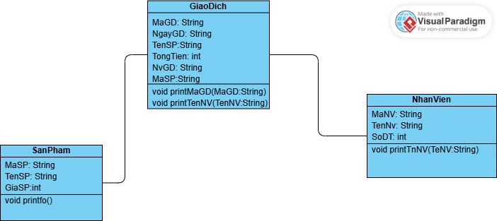
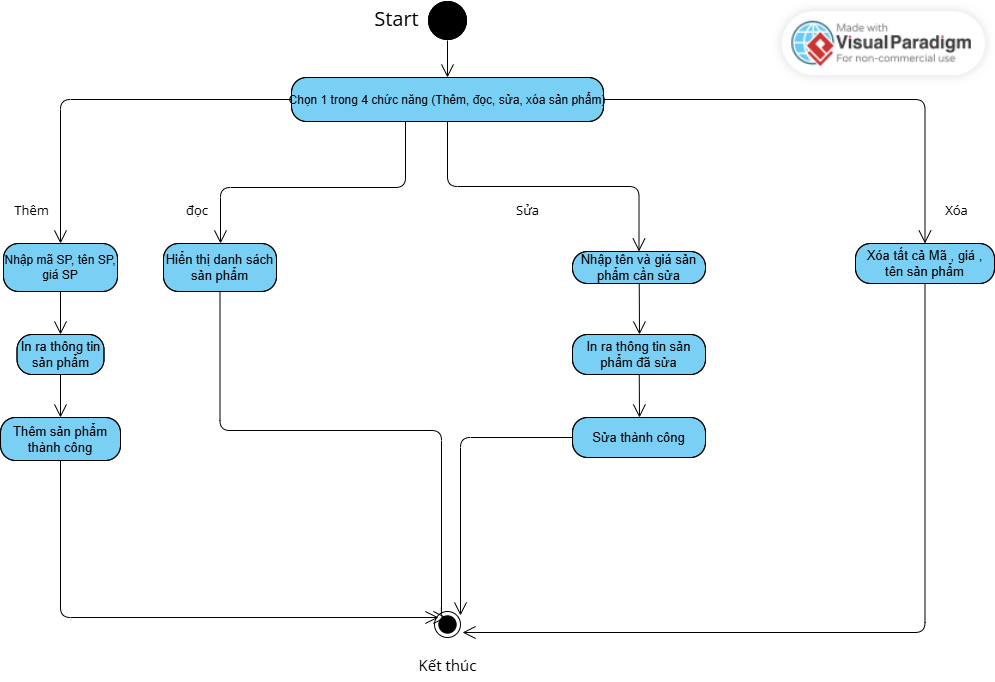
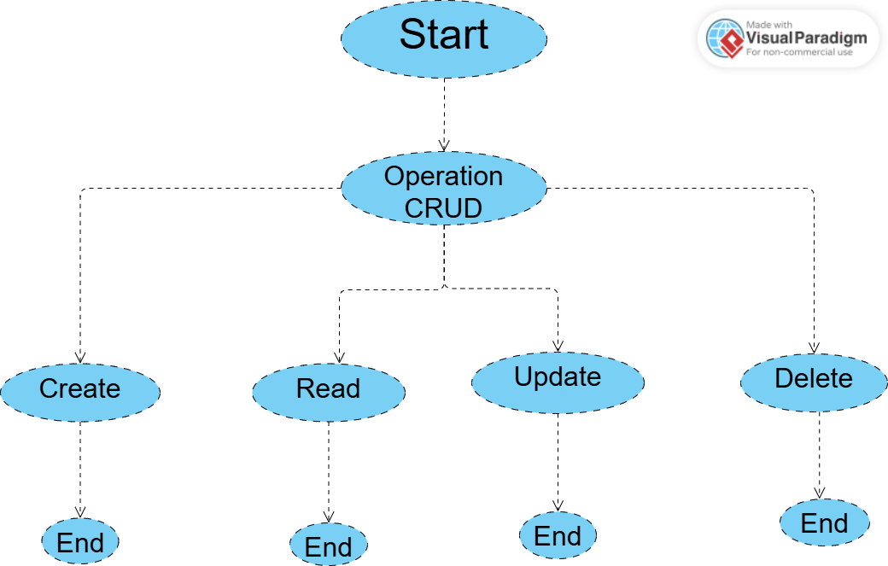
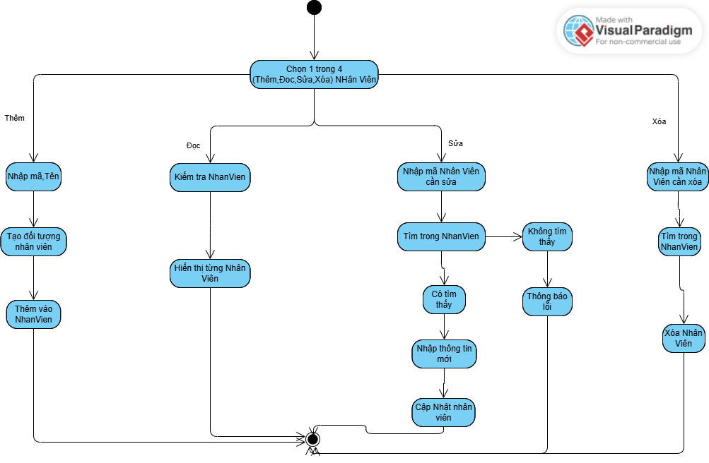

# OOP-N05_T3_2025_Group_Hai_Khanh

Ứng dụng quản lý quán cà phê

# Describe and Analyse the Project 

## Phân tích

04 Đối tượng chính:

```

KhachHang ( TenKH ; Makh ; sdt )
SanPham (TenSP ; Masp ; gia)
NhanVien ( MaNv ; Ten ; sdt)
Giaodich(MaGd,NgayGD,TenSP,MaSP,TongTien,NvGD)

```

## Miêu tả
nhanvien: 
 -ten nv:
 -ma nv:
 -sdt:

 ```
 Public class Nhanvien{
    int MaNv;
    String TenNv;
    String sdt;

    // phuong thuc dac biet vi cung ten voi Lop --> Constructor
public Nhanvien(int maNv, String tenNv, String sdt) {}

public void hienthi(){}

}

```
khachhang:
 -Ten kh:
 -Ma kh:
 -sdt:
```
public class KhachHang{
    int MaKh;
    String TenKh;
    String sdt;


    // phuong thuc dac biet vi cung ten voi Lop --> Constructor
   public KhachHang(int maKh, String tenKh, String sdt) {
    public void hienthi(){
    }
   }
}
```
 .
sanpham:
 -ten sp:
 -ma sp:
 -gia sp:
 .
 ```
 public class SanPham {
    int MaSp;
    String TenSp;
    int GiaSp;
    // phuong thuc

    // phuong thuc dac biet/constructor co ten trung ten class/ khoi tao Class
    // SanPham
    public SanPham(int maSp, String tenSp, int giaSp) {
    }

    public void In() {
    }
}
 ```
public class Giaodich {

    //bien mieu ta cho giao dich
    String MaGiaoDich;
    String NgayThangNamGiaoDich;
    String GioGiaoDich;
    double TongTien;


    //phuong thuc hoat dong
public Giaodich(String mgd,String ngd,String ggd,double tt){
    this.MaGiaoDich = mgd;
    this.NgayThangNamGiaoDich = ngd;
    this.GioGiaoDich = ggd;
    this.TongTien = tt; 
}
public void hienthi(){
    
}
```
https://online.visual-paradigm.com/share.jsp?id=343135383732382d31
https://online.visual-paradigm.com/share.jsp?id=343135383734342d31

```
# Sơ đồ hoạt động



 

# 5 phương thức hoạt động trong ứng dụng quản lí quán cà phê
1. Phương thức hiển thị giao dịch theo ngày và nhân viên
2. Phương thức tìm kiếm sản phẩm theo tên
3. Phương 
2.class HoatDongQuan(){

public Nhanvien nv;
    public KhachHang kh;
    public Giaodich gd;
    public SanPham sp;

public static void hienthigdtrongngay(){
   }
   
public static void timKiemTheoTen(ArrayList<SanPham> danhSachSanPham, Scanner sc) {
   }


# Thành viên:

Trịnh Tiến Hải (Mã SV:24100185; github:Hai123445)

Nguyễn Đức Khanh (Mã Sv: 24100401; github: duckhanh1301)

Đinh Đức Thịnh (Mã Sv:24100005; github:Manx-bit)

Nguyễn Lệ Thu
