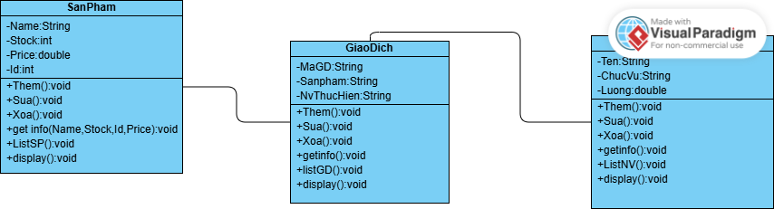
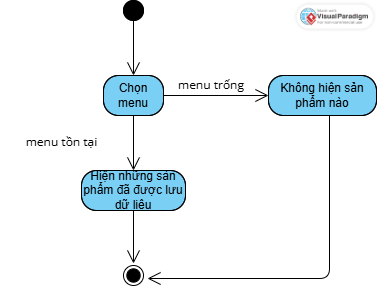
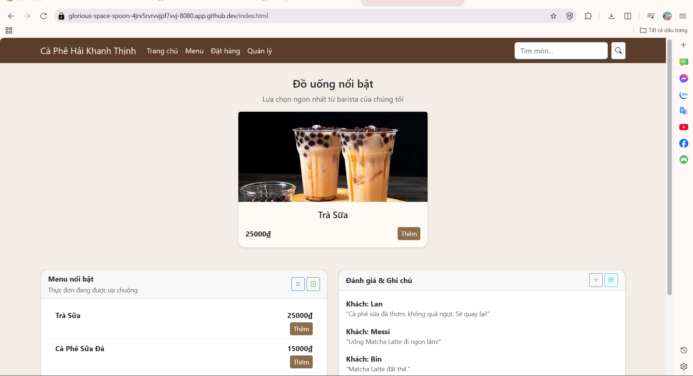
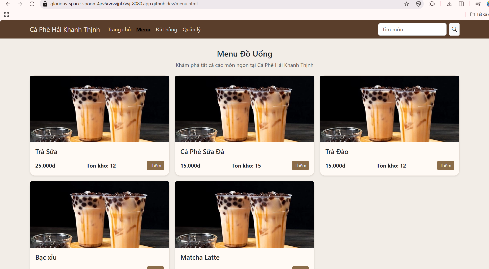
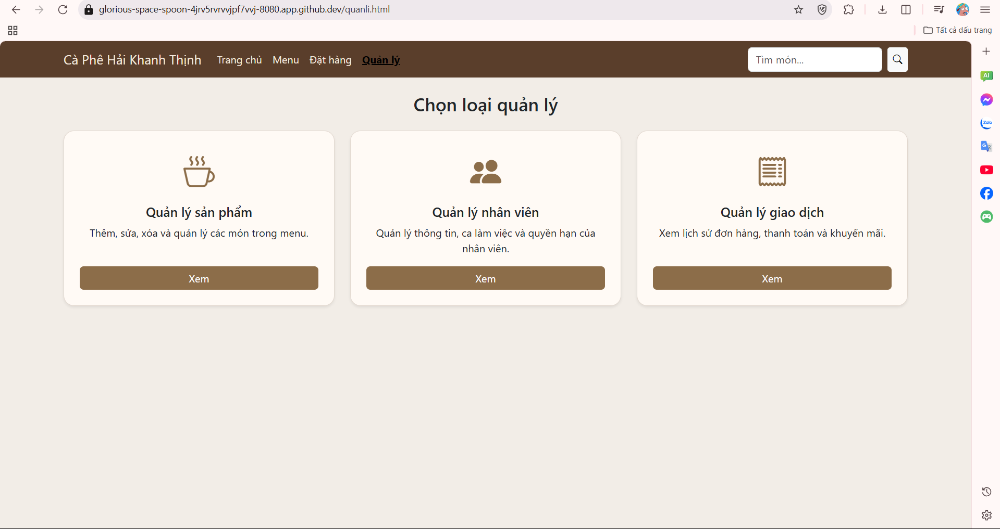
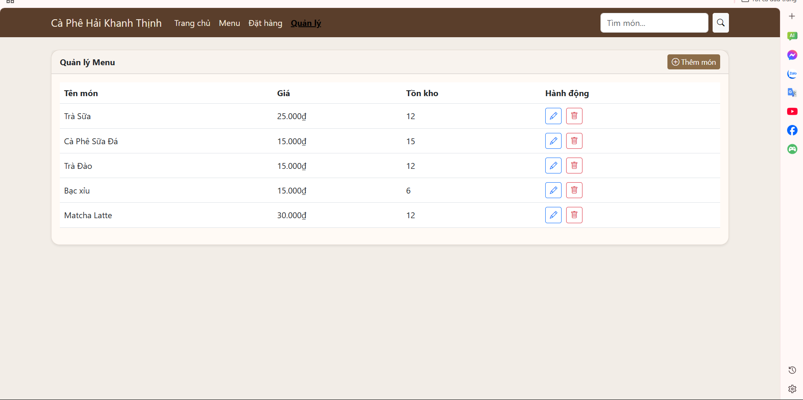
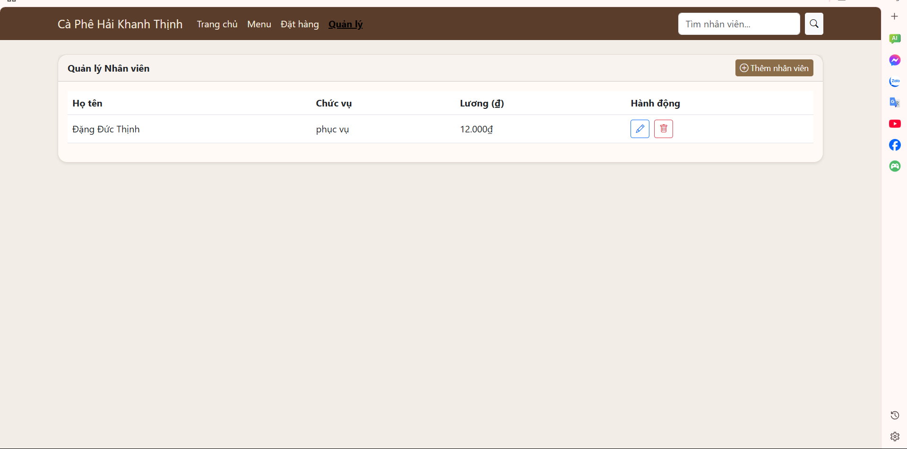

# OOP-N05_T3_2025_Group_Hai_Khanh

Ứng dụng quản lý quán cà phê

# Describe and Analyse the Project 

# Thành viên:

Trịnh Tiến Hải (Mã SV:24100185; github:Hai123445)

Nguyễn Đức Khanh (Mã Sv: 24100401; github: duckhanh1301)

Đinh Đức Thịnh (Mã Sv:24100005; github:Manx-bit)

#
Nội dung 01: Xây dựng ứng dụng quản lý quán cà phê Hải-Khanh-Thịnh

Yêu cầu:

-Giao diện Java Spring Boot.

-Có chức năng quản lý sản phẩm
+Thêm, sửa, xóa các sản phẩm 

+Hiển thị thông tin những sản phẩm

-Có chức năng quản lý nhân viên
+Thêm, sửa, xóa đơn hàng,thông tin nhân 
+Hiển thị thông tin của nhân viên

Dữ liệu được lưu trữ xuống file nhị phân

Cần tạo các lớp liên quan đến khách hàng, sản phẩm , và đơn hàng để đọc, ghi xuống 1 hay nhiều file.
Khi làm việc với dữ liệu trong bộ nhớ, dữ liệu cần được lưu trữ dưới dạng các Collection tùy chọn như ArrayList, LinkedList, Map, ....

Sinh viên có thể thêm các chức năng vào chương trình để ứng dụng phong phú hơn bằng cách thêm các nghiệp vụ cho bài toán (tùy chọn)

#Các sơ đồ của ứng dụng

+class diagram

- 

+Activity digram

- 

- 

- 

- 

- 

# Giao diện của ứng dụng
- Trang chủ

- menu

- Quản lý

- Sản phẩm

- Nhân viên

